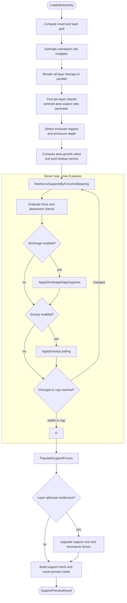
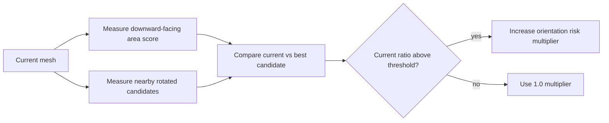
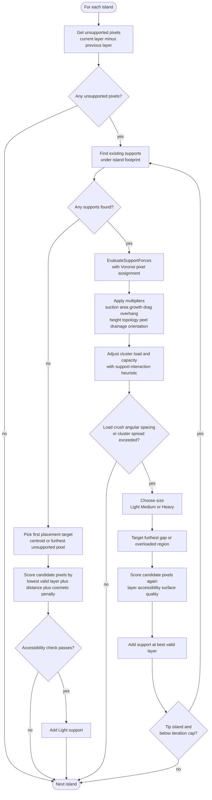
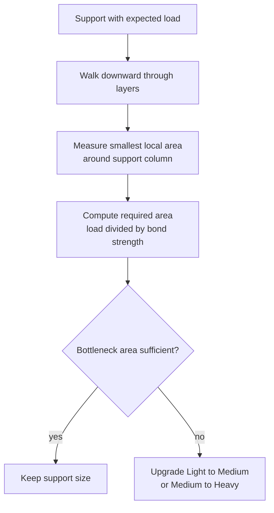

# Auto-Support Algorithm
{: .no_toc }

A detailed technical reference for the island-tip support generation algorithm used by the auto-support generation service.
{: .fs-6 .fw-300 }

<details open markdown="block">
  <summary>Table of contents</summary>
  {: .text-delta }
1. TOC
{:toc}
</details>

---

## Overview

The auto-support algorithm generates support point markers for MSLA/resin printing by treating the model as a stack of horizontal layer bitmaps. It finds regions of freshly-appearing geometry at each layer ("tip islands"), then runs a multi-pass physics-informed solver to place and size support tips.

The current implementation combines force estimation, topology classification, and placement-quality heuristics:

| Signal | Why it matters | Current approximation |
|---|---|---|
| **Peel force** | FEP separation load | Area x `PeelForceMultiplier` per pixel |
| **Suction** | Enclosed cups/hollows resist separation | Edge flood-fill plus enclosure ratio |
| **Area growth** | Rapid cross-section expansion spikes peel load | Layer-to-layer area delta ratio |
| **Gravity** | Lower supports carry accumulated model mass | Cumulative per-support weight pass |
| **Hydrodynamic drag** | Thin features see lateral flow load | Aspect-ratio and minimum-width heuristic |
| **Overhang severity** | Shallower overhangs need denser support | Unsupported-pixel ratio within island |
| **Peel kinematics** | Peel-front load is not uniform across bed | Position-dependent multiplier by peel direction |
| **Bridge vs cantilever** | Topology changes required support density | Anchored-edge classification |
| **Shrinkage** | Large flat areas curl during cure | Edge-support pass on low perimeter-to-area islands |
| **Layer adhesion** | Narrow load paths can delaminate | Bottleneck-area check per support |
| **Support interaction** | Dense clusters can both share and concentrate load | Cluster spacing heuristic |
| **Drainage risk** | Deep enclosed cavities trap resin and pressure | Enclosure depth multiplier |
| **Accessibility** | Deep interior supports are hard to remove | Open-direction scan around candidates |
| **Surface quality** | Tip marks should prefer less-visible regions | Boundary-distance penalty |
| **Orientation risk** | Poor orientation raises required support conservatism | Downward-area comparison against nearby rotated candidates |
| **Height bias** | Low layers are more failure-sensitive | Conservative multiplier near base |

---

## Pipeline



---

## Step 1: Grid Calculation

The model footprint determines the analysis grid. Voxel size and layer height are auto-scaled from the model dimensions, then clamped:

```
voxelSizeMm   = clamp( max(dimX, dimZ) / 48,  MinVoxelSizeMm,   MaxVoxelSizeMm   )
layerHeightMm = clamp( dimY / 48,              MinLayerHeightMm, MaxLayerHeightMm )

pixelWidth    = max(24, ceil(bedWidth  / voxelSizeMm))
pixelHeight   = max(24, ceil(bedDepth  / voxelSizeMm))
layerCount    = max(1,  ceil(dimY      / layerHeightMm))
```

**Example** - a 48 x 60 x 48 mm figurine with default tuning:

```
voxelSizeMm   = clamp(48/48, 0.8, 2.0) = 1.0 mm
layerHeightMm = clamp(60/48, 0.75, 1.5) = 1.25 mm
pixelWidth    = ceil(50/1.0) = 50   (48mm + 2mm BedMargin each side)
pixelHeight   = ceil(50/1.0) = 50
layerCount    = ceil(60/1.25) = 48
```

The bed area is padded by `BedMarginMm` on each side, giving the orthographic projection room to capture geometry at the edges.

---

## Step 2: Layer Slicing

Each layer is rendered at the midpoint of its slice:

```
sliceHeight[n] = (n * layerHeightMm) + (layerHeightMm * 0.5)
```

The slicer (`OrthographicProjectionSliceBitmapGenerator`) fires horizontal rays through each layer and produces a flat bitmap where `1` = cured resin, `0` = empty. All layers are rendered in a single batch call so the slicer can parallelise across layers.

**Cross-section view of a layer bitmap** (top-down, 9x7 pixels):

```
col:  0 1 2 3 4 5 6 7 8
row 0: . . . . . . . . .
row 1: . . # # # # # . .    # = cured resin
row 2: . # # # # # # # .
row 3: . # # # # # # # .
row 4: . . # # # # # . .
row 5: . . . . . . . . .
```

---

## Step 3: Island Detection

Connected lit pixels within each bitmap are grouped by 4-connected BFS flood-fill into "islands". Each island records:

- Pixel list and centroid (XZ in mm)
- Total area in mm2
- Bounding-box aspect ratio and minimum width
- Perimeter pixel count and perimeter-to-area ratio

Islands whose area falls below `MinIslandAreaMm2` are discarded.

**BFS expansion example** (starting from pixel marked `S`):

```
Before BFS:             After BFS (island A = {1,2,3,4,5,6,7,8,9}):

. . . . . . .           . . . . . . .
. . # # # . .           . . A A A . .
. S # # # . .    -->    . A A A A . .
. . # # . . .           . . A A . . .
. . . . . . .           . . . . . . .

centroid X = mean of column centres
centroid Z = mean of row centres
area = 9 pixels * pixelAreaMm2
```

---

## Step 4: Tip Island Classification

An island is a **tip island** when none of its pixels existed in the layer below - it is the first (lowest) appearance of that connected region. Tip islands always need at least one support.

```
Layer N-1:          Layer N:           Classification:

. . . . . .         . . # # . .
. . . . . .         . # # # # .        --> TIP ISLAND
. . . . . .         . . # # . .        (no overlap with layer below)


Layer N-1:          Layer N:           Unsupported pixels:

. . # # . .         . # # # # .
. . # # . .         . # # # # .        --> OVERHANG EXPANSION
. . . . . .         . . . . . .        (edges grew outward - the 6
                                        new edge pixels are unsupported)
```

**Unsupported pixels** - pixels that appear in layer N but not in layer N-1 - are the target for support placement. They represent freshly-cured geometry with no geometry beneath.

---

## Step 5: Suction Detection

Enclosed regions (cups, hollows) create vacuum suction during FEP film separation. The algorithm detects them by BFS flood-filling from all four bitmap edges through empty pixels. Any cured pixel that borders an unreachable empty cell is flagged as part of an enclosed region.

```
Bitmap (cup shape):        Reachable empty pixels (from edges):

. . . . . . .              R R R R R R R       R = reachable from edge
. # # # # # .              R # # # # # R
. # . . . # .    -->       R # E E E # R       E = enclosed void
. # . . . # .              R # E E E # R           (not reachable)
. # # # # # .              R # # # # # R
. . . . . . .              R R R R R R R

Cured pixels (#) bordering enclosed voids (E) are flagged.
Their effective peel force is scaled by:
  suctionMultiplier = 1 + (SuctionMultiplier - 1) * enclosureRatio
```

---

## Step 6: Area Growth Detection

When a model's cross-section expands rapidly between layers (e.g. a mushroom cap or flared skirt), more resin cures per layer and the peel force spikes. The algorithm tracks this:

```
layerAreaGrowthRatio[n] = (totalAreaMm2[n] - totalAreaMm2[n-1]) / totalAreaMm2[n-1]

If layerAreaGrowthRatio[n] > AreaGrowthThreshold:
    areaGrowthMultiplier = AreaGrowthMultiplier  (default 1.5)
else:
    areaGrowthMultiplier = 1.0
```

This multiplier feeds directly into `effectivePixelForce`, causing the solver to add more supports on rapidly flaring geometry.

## Step 6.5: Orientation Risk Estimation

Before the solver starts, the service estimates whether the current model orientation looks materially worse than a small set of nearby candidate rotations. This is not a full auto-orientation system - it is a conservative risk estimator used to avoid under-supporting obviously poor orientations.



The score is a weighted sum of downward-facing triangle area. If the current orientation is sufficiently worse than the best nearby candidate, the solver scales force estimates upward by `OrientationRiskForceMultiplierMax` capped by the measured ratio.

---

## Step 7: Solver Loop

The solver runs up to 8 passes. Each pass calls three sub-algorithms in order. The loop exits early when no sub-algorithm adds or changes any support ("stable solution") or the support cap is reached.

### 7a. Reinforce by Force and Spacing

This is the main support placement algorithm. It processes every island from layer 0 upward.



The four thresholds that trigger reinforcement are checked simultaneously:

| Threshold | Condition |
|---|---|
| Load overload | `totalVerticalPull > combinedCapacity` |
| Crush force | `maxCompressiveForce > CrushForceThreshold` |
| Angular force | `maxAngularForce > MaxAngularForce` |
| Spacing gap | `furthestPixelDistance > SupportSpacingThresholdMm` |

The force evaluation also incorporates these placement-related modifiers before thresholding:

- Support interaction adjusts effective cluster load and cluster capacity when many supports are tightly packed.
- Drainage depth increases force estimates for deep enclosed regions.
- Accessibility rejects candidate pixels that do not open to enough outward directions.
- Surface quality adds a placement penalty to deep interior pixels so supports bias toward boundaries when structure allows.
- Orientation risk scales force estimates upward when the current orientation appears materially worse than nearby alternatives.

**Tip islands** allow up to `MaxTipIslandAddsPerPass` (4) supports per pass before moving on. This prevents one large tip island from consuming the entire support budget.

**Non-tip (body) islands** are limited to one new support per pass and only when the layer is above the lowest quarter of the model. Support density is also compared against a height-scaled desired count:

```
desiredSupports = ceil(unsupportedAreaMm2 / (pi * spacingThreshold^2))
heightScaled    = max(1, ceil(desiredSupports * (0.15 + 0.85 * layerRatio)))
```

This makes the solver more conservative near the base where early-print failures are more expensive.

### 7b. Shrinkage Edge Supports

UV-cured resin shrinks as it polymerises, pulling inward from edges. Large flat islands (area > 25 mm2, perimeter-to-area ratio < 1.0) need extra edge supports to resist curling.

```
shrinkageStress = (ShrinkagePercent/100) * islandArea * ShrinkageEdgeBias
desiredEdgeSupports = max(1, floor(shrinkageStress / 10))
```

Edge pixels are those with at least one 4-connected empty neighbour. Support candidates are sampled at uniform stride across the sorted edge pixel list.

```
Island (8x4, flat):               Edge pixels (*):

. . . . . . . .                   . . . . . . . .
. # # # # # # .                   . * * * * * * .
. # # # # # # .                   . * . . . . * .
. . . . . . . .                   . . . . . . . .

ShrinkageEdgeBias=0.7: most new supports land on the perimeter (*)
```

### 7c. Gravity Loading

After force/spacing and shrinkage, accumulated weight is assessed. Each support collects the gravitational mass of all overhang pixels it covers:

```
voxelVolumeMm3  = pixelAreaMm2 * layerHeightMm
massPerVoxel_g  = voxelVolumeMm3 * (ResinDensityGPerMl / 1000)
layerWeight_N   = pixelCount * massPerVoxel_g * 9.81
perSupport      = layerWeight_N / supportCount (equal distribution)
```

Supports whose accumulated gravity load exceeds thresholds are upgraded:

| Condition | Action |
|---|---|
| gravityLoad > capacity * 1.5 | Upgrade to **Heavy** |
| gravityLoad > capacity | Upgrade to **Medium** (from Light) |
| gravityLoad > capacity * 0.5 | No change (within tolerance) |

---

## Step 8: Force Population and Layer Adhesion

The current solver keeps supports at their selected placement layer. It does **not** run a post-pass height-redistribution step.

After the solver converges, per-support force vectors are recomputed for visualisation and for the final layer-adhesion bottleneck check.

### 8a. Force Population

With the final support set fixed, per-support pull-force vectors are recomputed across all islands for visualisation in the 3D viewer. This uses the same Voronoi assignment as the solver but accumulates the `PullVector` (lateral + signed vertical components) into each `SupportPoint.PullForce`.

### 8b. Layer Adhesion Reinforcement

The final support set is then checked against the narrowest load path below each support. The algorithm walks downward through the support column and estimates the smallest local cross-section area that still contains the support position.



This catches cases where the support tip itself is strong enough, but the thin geometry beneath it is not.

---

## Force Model in Detail

### Voronoi Pixel Assignment

Each unsupported pixel is assigned to whichever support is closest in 2D (XZ plane). This creates a Voronoi partition:

```
Two supports S1=(col 2) and S2=(col 6), island spans col 0-8:

col: 0  1  2  3  4  5  6  7  8
     1  1  1  S1 *  2  S2 2  2

1 = assigned to S1 (nearest)
2 = assigned to S2 (nearest)
* = equidistant pixel
```

### Force Components

For each support `S` and its assigned `n` pixels:

$$
F_{vertical} = n \times pixelArea \times PeelForce \times suctionMult \times areaGrowthMult
$$

$$
F_{angular} = \sum_{pixels} (F_{pixel} \times leverArm_i)
$$

where $leverArm_i$ is the distance from pixel $i$ to the island centroid (not to the support).

$$
F_{compressive} = \max(0, -(F_{vertical} - F_{angular} / r))
$$

$$
F_{lateral} = (centroid_{XZ} - S_{XZ}) \times 0.35 \times \sqrt{F_{vertical}}
$$

The compressive force represents the net downward load when the angular moment would overcome the vertical uplift - i.e. the support is being pushed down rather than pulled up.

### Hydrodynamic Drag

Thin features (island `MinWidthMm < MinFeatureWidthMm`) receive an additional lateral force modelling resin flow resistance during film separation:

```
heightEstimate = aspectRatio * minWidth
dragLateralForce = heightEstimate * minWidth * DragCoefficientMultiplier

(distributed equally across all supports on the island)
```

### Capacity

$$
capacity = \pi \times r^2 \times ResinStrength
$$

The capacity grows with the square of the tip radius, so switching from Light (0.7 mm) to Heavy (1.5 mm) roughly quadruples capacity.

---

## Support Sizing

Support size is chosen in the reinforcement loop based on the **overload ratio** - the maximum of the three force ratios:

$$
overloadRatio = \max\left(\frac{F_{vertical}}{capacity},\ \frac{F_{compressive}}{CrushThreshold},\ \frac{F_{angular}}{MaxAngularForce}\right)
$$

| overloadRatio | Assigned size |
|---|---|
| > 1.8 | **Heavy** |
| > 1.25 | **Medium** |
| <= 1.25 | **Light** |

Default tip radii and resulting capacities (ResinStrength = 1.0):

| Size | Tip radius | Capacity |
|---|---|---|
| Light | 0.7 mm | ~1.54 |
| Medium | 1.0 mm | ~3.14 |
| Heavy | 1.5 mm | ~7.07 |

---

## Worked Example: Mushroom Cap

Consider a mushroom shape: a 4 mm stem topped with a 20 mm diameter cap at 30 mm height.

**Layer 0-20** (stem, ~4 mm wide):
- Each layer produces one small island. It fully overlaps with the layer below, so no tip islands, no new supports from the reinforce pass.

**Layer 21** (cap begins, ~20 mm wide):
- The cap pixels do not exist in layer 20 (stem cross-section is ~4 mm). This is a **tip island**.
- Area = ~314 mm2, far exceeding the 4 mm2 minimum.
- First iteration: no existing supports in range. Support placed at centroid.
- Second iteration: one Light support at centroid. Area growth ratio from layer 20 to 21 is enormous (~(314-12)/12 = 25x), exceeding `AreaGrowthThreshold`. `effectivePixelForce` is multiplied by `AreaGrowthMultiplier`.
- Force evaluation: single support at centroid, far from many edge pixels. `furthestPixelDistance` = ~10 mm >> `SupportSpacingThresholdMm` (3 mm default). New Heavy support at furthest pixel.
- Continues until spacing, load, and angular conditions are satisfied. Typically 8-12 supports for a 20 mm cap.

**Suction check**:
- If the cap has a concave underside (hollow), enclosed pixels are detected. The `suctionMultiplier` on affected supports rises, causing additional supports to be placed inside the hollow.

**Gravity check**:
- The 20 mm diameter cap has significant mass. If any support's accumulated gravity load exceeds capacity, it is upgraded (typically Light -> Medium or Heavy for thick caps).

**Shrinkage check**:
- The cap's perimeter-to-area ratio is low (~0.2 for a circle). Several Light supports are placed around the rim.

---

## Mesh Generation

### Support Sphere Mesh

Each `SupportPoint` is rendered as a UV sphere with 8 latitude segments and 12 longitude segments, producing 144 triangles per support. Spheres are generated in parallel and merged into a single `Triangle3D` list.

### Voxel Body Preview Mesh

The voxel body is a simplified representation of the model volume for context. It is built by:

1. Extracting axis-aligned rectangles (`VoxelRect`) from each layer bitmap using a greedy scan-line algorithm.
2. Tracking which rectangles persist across consecutive layers ("active blocks").
3. When a rectangle disappears or the model ends, emitting a box (12 triangles) spanning its height range.

The total triangle count is capped at 2,000,000. If the cap is reached, the mesh is truncated and a warning is logged.

---

## Performance Characteristics

The algorithm is fully parallelised using `Parallel.For` / `Parallel.ForEach` with `MaxDegreeOfParallelism = ProcessorCount`. Key parallel sections:

| Section | Parallelised when |
|---|---|
| Layer bitmap rendering | Always (slicer batch) |
| Island detection + voxel rect extraction | Always (per-layer) |
| Suction detection | Always (per-layer) |
| Force evaluation (`EvaluateSupportForces`) | unsupportedPixels >= 256 and supportCount > 1 |
| Support lookup (`FindSupportingSupportsForPixelSet`) | supportPoints >= 1024 |
| Furthest-pixel search | pixels >= 256 and supports >= 2 |
| Gravity weight accumulation | Always (per-layer range) |
| Force population (`PopulateSupportForces`) | Always (per-layer range) |
| Sphere mesh generation | Always (per support) |

Work is split into `ProcessorCount * 4` ranges to keep threads busy during irregular workloads.

---

## API

### Endpoints

| Method | Path | Description |
|---|---|---|
| `POST` | `/api/models/{id}/auto-support/jobs` | Start a generation job |
| `GET` | `/api/models/{id}/auto-support/jobs/{jobId}` | Poll job status and retrieve support points |
| `GET` | `/api/models/{id}/auto-support/jobs/{jobId}/geometry` | Download binary mesh envelope |

### Key Types

- `SupportPoint` - position, tip radius, pull force vector, size enum
- `SupportPreviewResult` - support sphere geometry, voxel body geometry, support point list
- tuning overrides - all tunable parameters as nullable fields; null fields fall back to `AppConfigService` values
